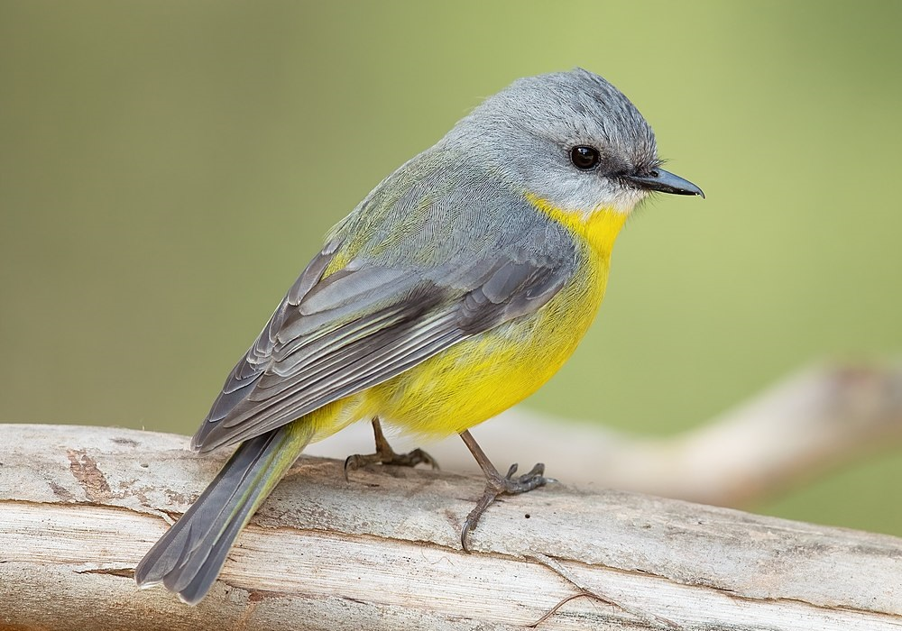

  <a href="project1.html" class="project-card">
    
    

      <h3 class="project-title">Project One</h3>
      
A brief description of Project One goes here. It can span up to a few lines.

    

  </a>

  <a href="project2.html" class="project-card">
    
    

      <h3 class="project-title">Project Two</h3>
      
A quick overview of what this project is about. Summarize the key idea or result.

    

  </a>

