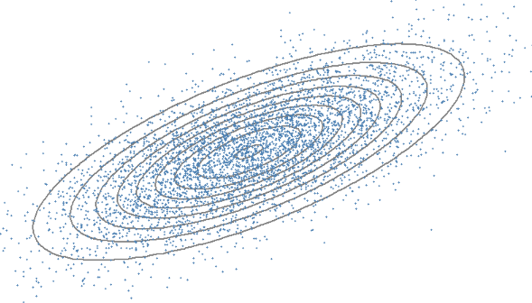

<link rel="stylesheet" href="/projects.css">

    <a href="HPO.pdf" class="project-card">
    
    

      <h3 class="project-title">Hyper-Parameter Optimziation</h3>
      
Exploration of some current Hyperparameter Optimziation Techniques. Comparing: Grid Search, Random Search, Bayesian Optimization, Hyperband and Sequential Uniform Designs.

    

  </a>
  <a href="mc_mthods.html" class="project-card">
    
    

      <h3 class="project-title">Monte Carlo Methods</h3>
      
Markov Chain Monte Carlo and Hamiltonian Monte Carlo Methods explored and explained. Theory and examples with R code.

    

  </a>
  <a href="MonteCarlo.html" class="project-card">
    
    

      <h3 class="project-title">Monte Carlo Blackjack</h3>
      
Using Monte Carlo Simulation to test various Blackjack strategies, with a mathematical approach and review of theory.

    

  </a>

